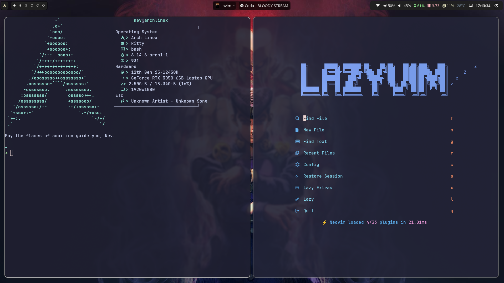

+++
title = "About"
date = "2025-07-02T12:21:34+05:30"
draft = false
+++

 

-  This website is for my blogposts. This will probably help me with being consistent and also being 
able to share my experiences with others.

- Though it probably won't get many views, I hope its helpful.

- I like to use Linux, I use **Arch Linux** as my Operating System.

- I'm currently working on my startup **blud - your internet dorm** - will give details in blogs.

**My setup:** 

- I like to make cool tools and scalable Backend Systems.

- Currently I'm learning **Golang**

- I develop my APIs in **NestJS** as it's a very scalable and cool framework.
---
- **Some of my projects are:** 

1. **Dots - A Dotfile Manager CLI-Tool to symlink, version control and sync your
Config files with git**

    Link: [Github Repo for Dots.](https://github.com/Ethics03/Dots)

2. **Uriel - AI-Powered API Security Testing with Llama3 (CLI-Tool)**

    Uriel basically sends a request to your API-endpoint and the response
    is analysed by Llama3 to provide you with possible security flaws.
    Missing headers etc.

    Link: [Github Repo for Uriel](https://github.com/Ethics03/Uriel)

3. **Minpin - A URL Shortener in Golang**

    RestAPI based URL-Shortener for easy short links for big chunky URLs.

    Link: [Github repo for Minpin](https://github.com/Ethics03/Minpin)

